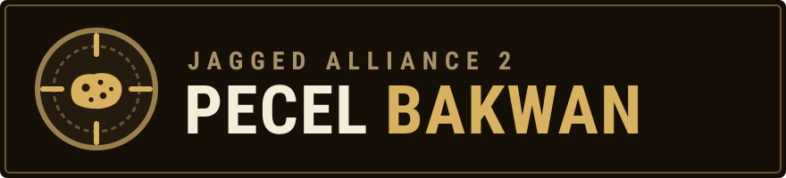

# JA2 Pecel Bakwan

> **JA2 rebuilt as the game it always wanted to be.** A native modern front end, a smarter Queen, deeper tactics, a living world — written by AI agents, proven by tests that play the game.

JA2 Pecel Bakwan (named after the Javanese street-food combo of vegetables in peanut sauce with a crispy fritter on top) is a fork of [JA2-Stracciatella](https://github.com/ja2-stracciatella/ja2-stracciatella). Upstream made Jagged Alliance 2 run everywhere and fixed its bugs while keeping the 1999 game intact. This fork starts from that foundation and goes the other way: **it is not a preservation project.** It is a modern reimplementation of JA2 with a richer tactical and strategic game, and the revamp *is* the game: new mechanics ship on by default, with no "vanilla mode" and no obligation to keep old saves loading. It needs your own copy of Jagged Alliance 2 game data; the executable is still called `ja2`.

> **Unofficial fan project.** Not affiliated with or endorsed by the owners of Jagged Alliance. No game data is included or distributed.

---

## What it looks like now

Every screen is being redesigned for modern displays (16:9, 16:10, 21:9; 1280x720 up to 4K) instead of stretching a 640x480 box. Every screenshot below is taken from the real game by the automated harness, at 1920x1080.

| Strategic map | Tactical HUD |
|---|---|
|  |  |
| Full-screen map with dockable panels, time compression, message log and sector intel. | Squad bar, per-merc AP/HP/breath/morale, native action bar and turn control. |

| Inventory and merc detail | Route plotting |
|---|---|
|  |  |
| Drag-and-drop inventory, attributes, attachments, slot-aware item pictures. | Native confirmation modals and shortcuts replace hand-placed popups. |

## Where we are headed

The goal is a **modern Jagged Alliance 2 with a richer game underneath**: one that looks and plays like it was made for a 1440p/4K monitor today, with tactics and a strategic world that push back harder than the 1999 original. Four directions pull in the same line:

- **A native, modern presentation.** Every screen is redesigned for widescreen and high DPI instead of stretching a 640x480 box, and the world is drawn by a GPU renderer.
- **A rich tactical layer.** Equipment is a system (attachments, ammo, condition), combat is a simulation (aim, recoil, suppression, morale, stances, detection, light), and the soldier is a character (traits, medical, encumbrance, melee, breaching).
- **A rich strategic layer.** A living world that remembers what you did: towns, factions and NPCs react to a deed ledger that says whether you are the savior or the next dictator, while militia, facilities, economy and sector inventory give the map teeth.
- **An opponent with a mind.** The Queen gets an emotional drive state and a policy layer. An optional LLM gives her a voice and turns your free text into a bounded set of intents; it never writes game state.

What is being worked on right now, and in what order, is on the [issue tracker](https://github.com/adhikasp/ja2-stracciatella/issues), the [milestones](https://github.com/adhikasp/ja2-stracciatella/milestones) and the [JA2 Modernization Roadmap](https://github.com/users/adhikasp/projects/1) board. They change often; this README does not try to track them. The reasoning lives in [docs/plan/](docs/plan) and [docs/ui/](docs/ui).

## Design principles

These break ties when a plan and a PR disagree (full text in [AGENTS.md](AGENTS.md#game-design-principles)):

1. **The revamp is the game.** This is not a preservation project. New mechanics ship on by default, with no vanilla mode and no obligation to keep old saves or old behavior.
2. **Native-first.** Gameplay systems are C++ in the engine, not runtime JSON rules. `src/externalized/` is for the data the original game shipped with; only a few leaf tunables are exposed as toggles.
3. **Testable by construction.** Every system has a unit-test surface and a deterministic headless driving surface. If a mechanic cannot be asserted headless, it is not done.
4. **Curate.** Take the design idea and ship a small, balanced set with unit-tested invariants, not a catalog.
5. **Reimplement ideas, never port code.** Other JA2 projects (1.13 and friends) inspire; their code, UI and data files are not imported.
6. **Moddable stays a feature.** VFS layering and the Lua scripting API remain the mod surface.

## How it's built: agents with a test harness

This repository is developed **primarily by AI coding agents**; a human owner sets direction, approves the art style and each screen's wireframes, and reviews. Plans, code, tests, screenshots and PRs are mostly written by agents under the rules in [AGENTS.md](AGENTS.md). What makes that safe is that the game can verify itself without a person at the keyboard:

- **Headless and scriptable.** The game runs on a virtual clock and is driven from the shell or Lua: `python tools/ja2ctl.py click "New Game"`, `ja2ctl shot`, `ja2ctl state`. Native UI is addressed by element id, not pixel position. See [docs/automation.md](docs/automation.md).
- **Agents look at the result.** Golden screenshots and layout audits cover every screen at every reference resolution, and every PR that changes visuals carries real-game screenshots at 640x480 and widescreen that a reviewer opens.
- **Tests play the game.** Unit tests (`ja2 -unittests`) plus `ctest -L e2e`: per-screen parity tours, deterministic tactical battles, and campaign state authoring that jumps straight to any point in a campaign.
- **Issues are the unit of work.** One issue per slice, one PR that closes it, a board for ordering, milestones for shippable increments. Plans stay in `docs/plan/`.
- **The owner's gate is taste.** Style and wireframes are product decisions; everything else has to prove itself.

Want to contribute or watch how it works? Start with [AGENTS.md](AGENTS.md) and [docs/automation.md](docs/automation.md).

## How to start the game

1. Install the original **Jagged Alliance 2** on your computer. This project uses its data files and ships none of its own.
2. [Compile](COMPILATION.md) it from this repository (or grab a build from CI, if one is available for your platform).

### First start

3. Start the game. On the first run, or whenever the configured game directory cannot be used, the native setup screen opens.
4. Use it to set **"JA2 Data Directory"** to the directory where the original game was installed in step 1 (type the path or use the browse button). It also picks the save game directory, the resource version and mods, and shows the last `ja2.log`. Press **Apply** to write the configuration, then **Start game** to relaunch.
5. If you did not install the English version, select the correct **"Resource version"** (localization), or press **"Guess version"**. Note the two Russian releases: `RUSSIAN` for "BUKA Agonia Vlasty" and `RUSSIAN_GOLD` for "Gold".

The native setup screen replaced the old standalone launcher. The configuration lives in `%USERPROFILE%\Documents\JA2\ja2.json` on Windows, or `~/.ja2/ja2.json` on Unix-like systems. You can also edit `game_dir` by hand, or pass a version explicitly: `ja2.exe -resversion FRENCH`.

Supported localizations: `DUTCH`, `ENGLISH`, `FRENCH`, `GERMAN`, `ITALIAN`, `POLISH`, `RUSSIAN`, `RUSSIAN_GOLD`. Run `ja2.exe -help` for the full list of options.

## Building from source

See [COMPILATION.md](COMPILATION.md) for toolchains and IDE setup. The short version:

- **macOS:** `cmake -S . -B build && cmake --build build -- -j$(sysctl -n hw.logicalcpu)`.
- **Windows (MSYS2 MinGW64):** configure with the `MSYS Makefiles` generator into `_bin`, then `make -j$(nproc)`.
- **Tests:** `./ja2 -unittests`, and `ctest -L e2e` from the build directory.

Per-machine commands, the automation workflow and the repo layout are documented in [AGENTS.md](AGENTS.md).

## History of the project

The original project was run by Tron from 2006. He cleaned up the JA2 sources and made them portable — over *7000 commits* in the original SVN repository at `svn://tron.homeunix.org/ja2/trunk`. Work ceased in 2010. The [original project homepage](http://tron.homeunix.org/ja2) is gone; some history survives in the [JA2-Stracciatella Q&A](http://thepit.ja-galaxy-forum.com/index.php?t=msg&th=13222) and the [Wayback Machine](https://web.archive.org/web/20140204204243/http://tron.homeunix.org/ja2).

The community then revived the project at [ja2-stracciatella/ja2-stracciatella](https://github.com/ja2-stracciatella/ja2-stracciatella), which this fork continues under a new name, since it has diverged far from what upstream is for.

## License

This project is **non-commercial**, as the original source code license requires: do not sell it or distribute it for profit. Unless specified explicitly in the commit message, all changes since `commit 8287b98` are released to the public domain. All libraries in `dependencies/lib-*` have their own licenses.

It is not known under which license Tron released his changes; all we know is that the source codes were publicly available in his SVN repository.

The original Jagged Alliance source code was released by Strategy First Inc. in 2004 under the Source Code License Agreement ("SFI-SCLA"). The license is in [SFI Source Code license agreement.txt](SFI%20Source%20Code%20license%20agreement.txt).
